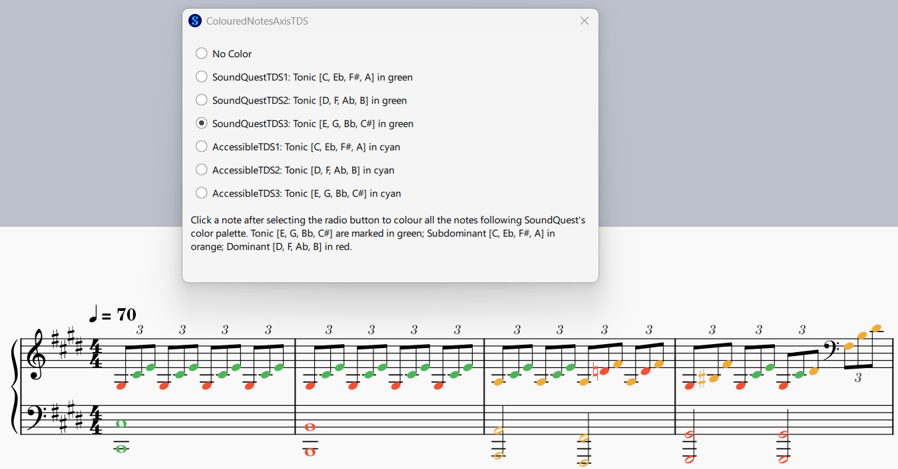
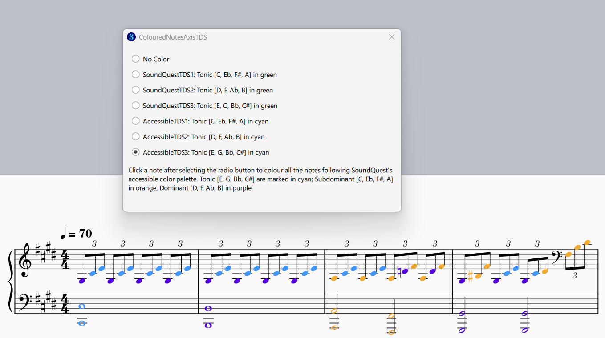

# coloured-notes-musescore-plugin (Axis system, SoundQuest colour theme)
A musescore plugin that colours any notes and accidentals present in a composition based on the chosen system.

This repository uses the Axis system, which classifies the 12 chromatic notes into 3 groups of 4 notes each, with each group categorised as a “tonic”, “subdominant”, or “dominant”. 

As for the colour scheme, the plugin uses that of SoundQuest:

| function | default colour | alternative colour (for accessibility) |
| --- | --- | --- |
| tonic | green (#49B656) | cyan (#4096FF) |
| subdominant | orange (#F1AB31) | orange (#F1AB31) |
| dominant | red (#F15031) | purple (#5701E1) |

## Screenshots

Selecting either SoundQuestTDS1, SoundQuestTDS2, or SoundQuestTDS3 in the plugin will colour the notes in green (tonic), orange (subdominant), and red (dominant), as shown below.

Choosing AccessibleTDS1, AccessibleTDS2, or AccessibleTDS3 will colour the notes in cyan (tonic), orange (subdominant), and purple (dominant), as shown below.

